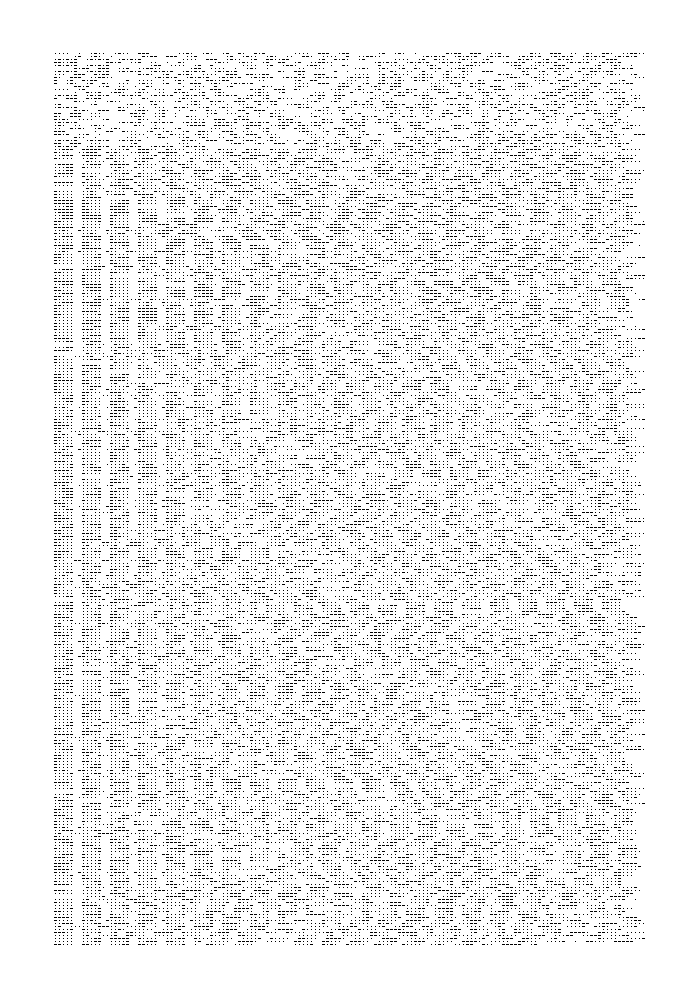
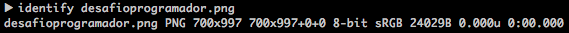

<h1>Desafío Día del Programador</h1>

<h4>Descripcion</h4>
<br>
<blockquote>
¡¡Feliz Día del Programad@r!! 😁
<br>Hemos encontrado en un libro antiguo una hoja que luego de procesarla digitalmente contiene algo que parece tener algún sentido. 
<br>Lamentablemente aún no hemos podido descifrarlo, pero como en Mercado Libre disfrutamos mucho los desafíos, quisiéramos revelar el misterio. ¿Te crees capaz de enfrentarlo?
<br>Quien logre resolverlo tendrá un reconocimiento especial. Enviar tus respuestas hasta el lunes 18/09.
</blockquote>

<br>La imagen es esta: https://drive.google.com/file/d/0B2ff6IKt-44lU1JrV2QtdXRwaE0/view


```python
#La imagen
from IPython.display import Image
Image(filename='imagenes/desafioprogramador.png') 
```





<h2>Morse a Texto</h2>

Usé identify para ver las propiedades de la imagen (si es RGB, ancho*alto, etc).


```python
Image(filename='imagenes/screen_identify.png') 
```





Probé levantar la imagen como chars/unsigned chars en C++, pero me encontré con varios problemas (detecté muchos pixeles distintos que claramente no los hay y todos agrupados al principio).
<br> Así que busqué formas de hacerlo con Python3 y esto fue lo que quedó.


```python
from PIL import Image

blanco=(255,255,255)
negro=(0,0,0)

punto = [blanco,negro,blanco]
barra = [negro,negro,negro]
fin_letra = [blanco,blanco,blanco]

morseAlphabet ={
        "A" : ".-",
        "B" : "-...",
        "C" : "-.-.",
        "D" : "-..",
        "E" : ".",
        "F" : "..-.",
        "G" : "--.",
        "H" : "....",
        "I" : "..",
        "J" : ".---",
        "K" : "-.-",
        "L" : ".-..",
        "M" : "--",
        "N" : "-.",
        "O" : "---",
        "P" : ".--.",
        "Q" : "--.-",
        "R" : ".-.",
        "S" : "...",
        "T" : "-",
        "U" : "..-",
        "V" : "...-",
        "W" : ".--",
        "X" : "-..-",
        "Y" : "-.--",
        "Z" : "--..",
        " " : "/",
        "?" : "..--..",
        "*" : ".-.-.-",
        "," : "--..--",
        "0" : "-----",
        "1" : ".----",
		"2" : "..---",
		"3" : "...--",
		"4" : "....-",
		"5" : ".....",
		"6" : "-....",
		"7" : "--...",
		"8" : "---..",
		"9" : "----."
}
inverseMorseAlphabet = dict((v,k) for (k,v) in morseAlphabet.items())

im = Image.open("imagenes/desafioprogramador.png") #Can be many different formats.
pix = im.load()
width, heigth = im.size
tipos_de_pixels = []

def indice_mas_a_la_izquierda(anImage):
	primera_linea = heigth
	ultima_linea = 0
	mas_a_la_izquierda = width
	mas_a_la_derecha = 0

	vi_la_primer_linea = False
	for j in range(0,heigth):
		vi_al_primer_punto_negro = False
		encontre_algo = False

		for i in range(0,width):
			if negro == pix[i,j]:

				mas_a_la_izquierda = min(i, mas_a_la_izquierda)

				primera_linea = min( j, primera_linea)

				mas_a_la_derecha = max( mas_a_la_derecha, i)

				ultima_linea = j

	return primera_linea, ultima_linea, mas_a_la_izquierda, mas_a_la_derecha


i_arriba,i_abajo,i_izq,i_der = indice_mas_a_la_izquierda(im)

contador_entero=0
for fila in range(0,heigth):
	for columna in range(0,width):
		if negro == pix[columna,fila]:
			contador_entero+=1

contador_recortado=0
texto = ""

letra_en_progreso = ""
espacios = 0
for fila in range(i_arriba,i_abajo+1,3):
	columna = i_izq

	if letra_en_progreso != "":
		texto += (inverseMorseAlphabet[letra_en_progreso])
		letra_en_progreso = ""
	
	espacios=0

	while columna < i_der+1:

		if punto == [pix[columna,fila],pix[columna+1,fila],pix[columna+2,fila]]:
			letra_en_progreso += "."
			contador_recortado +=1
			espacios=0

		if barra == [pix[columna,fila],pix[columna+1,fila],pix[columna+2,fila]]:
			letra_en_progreso += "-"
			contador_recortado += 3
			espacios=0

		if fin_letra == [pix[columna,fila],pix[columna+1,fila],pix[columna+2,fila]]:
			espacios +=1

			if 1 < espacios and letra_en_progreso != "":
				texto += (inverseMorseAlphabet[letra_en_progreso])
				letra_en_progreso = ""
			if 2 < espacios and espacios < 4:
				texto += " "

		columna +=4
```


```python
#Si Recorri la misma cantidad de pixeles negros en la imagen esto deberia ser igual 
print (contador_recortado)
print (contador_entero)
```

    50092
    50092


Y nuestro texto termina siendo...


```python
print(texto)
```

    HELLO FRANK HOW ARE YOU DOING? ARE YOU ALRIGHT? ********** HOLA, ACA HABLA CACHO , QUIEN LLAMA? ******** ** WHAT HAPPEN THERE? WHO ARE  YOU? WHERE IS FRANK? **** ****** NO TE ENITENDO NADA, SOY CACHO, NO HABLAS CASTELLANO? ********** PLEASE STAY THERE, I AM SEARCHING FOR A TRANSLATOR* HOLA, SOY PEDRO,  QUIEN ESTA DEL OTRO LADO? QUE HA PASADO CON FRANK? NOS PUEDE  EXPLICAR LA SITUACION? *** ******* YO SOY CACHO, ESTOY EN LA CABINA DE COMUNICACION DEL BARCO, FRANK SE FUE ARRIBA A LA FIESTA? ********* * DISCULPE CACHO, REALMENTE NO COMPRENDEMOS LA SITUACION, CREEMOS QUE USTED ESTA DESORIENTADO, NOS PUEDE DECIR EXACTAMENTE LA FE CHA DE HOY Y DONDE SE ENCUENTRA * ********** 14 DE AB RIL DE 1912, Y NO PUEDO EXPLICAR LA SITUACION PORQUE ES ALG O EMBARAZOSA PARA MI, QUISIERA QUE HABLEMOS SEGUN EL PROTOCOLO DE SEGURIDAD HEX ******* *** COMPRENDIDO CACHO, PASE MOS A ESE PROTOCOLO* ***** ***** 436163686F3A 20486F6C61204672616E 6B2C206372656F20717565 2064652065 73746120666F726D6120736572C3A120  6DC3A17320736567757261206E756573 747261206 36F6D756E6963616369C3B 3 6E2E0A4C612073697475616369C3B36E 20657320616C676F20636F6D706C656A  612C20736F7920756E20706F6C697AC3 B36E2C206D652068616E206465736375  62696572746F20792063 6F6D6F206361 73746967 6F206D652068616E207472 61 C3AD646F2061206C612 0636162696E61 2064652 0726164696F2E0A4772616 369 617320612071756520796F206573746F 79206 17175C3AD2C206672616E6B2073 652068612069646F 2061206C61206669 6573 746120717565207469656E656E20 6172726962612C20616C746F20717569 6C6 F6D626F212E0A0A50656472 6F3A20 456E7469656E646F206C6F2071756520 6469 63652C207065726F20736 5706120 717565206C612 073697475616369C3B3 6E20657320616C676F20636 F6D706C65 6A612E204573 746520626172636F2065 73206E75657374726120736567756E64 6120617075 657374612C0A6C7565676F 2064652071756520656C 204F6C796D70 69632074 75766965726120616C677 56E 6F7320646573706572666563746F732E 204573706572616D6F7320717565 2065 7374C3A920636170 6163697461646F20 7061 726120657374612074617 2656120 7265616C6D656E746520696D706F7274 61 6E74652E0A0A436163686F3A204F62 76696F20506564 726F2C207175656461 74 65207472616E6B692E2053 69206861 63652066616C 7461206C7565676F2074 65206C6C616D6F2E0A0A0A0A 5132466A 614738364945 6876624745675547566B 636D38734947786849474E685A324674 62334D754945567349474E6863476B67 6257566B61573867596D3 979636D466A 61473867633255670A624745675A476C  7649474E76626E5279595 34231626942 70593256695A584A6E49486B67633255 67626D397A4947567A644 D4F68494778 735A573568626D52764947526C49474 6 6E645745670A5A577767 596D46795932 3875436C 426C5A484A764F69425264 57 55675A584D67624738676358566C4947 6868494 7396A64584A79615752765079 426B5A53427477364 67A4947526C6447 46730A6247567A4C67704459574E 6F62 7A6F675532397549477868637941794D 7A6F314D4342354947357663794 26F64 57356B615731766 3797767625746755A 475 56759586C315A474575436C426C0A 5A484A764F6942546157356A5A584A68 6257 567564475567626D38676 348566C 5A47386759334A6C5A5849676358566C 4947567349474A68636D4E764 9484E6C 4947567A644D4F 70494768310A626D52 705A57356B6279776759334A6 C627942 7864575567625 755675A584E30773645 676147466A615756755A473867645735 6849474A7962 3231684C67704459574E 6F627A6F6755326B730A494 7566D5A57 4E3061585A6862575675644755676332 55675A584E3077364567614 856755A47 6C6C626D52764C43426A623231764948 42315A575276494768685 93256794948 4268636D4 5670A63484A76596D46796 2 4738676553427864575567625746755A 4755675 9586C315A474575436C426C5A 484A764F69424D5A53423262336B6759 5342776 247467564475668636942 3162 6942770A636D39696247567459537767 6358566C49484E704947567A644 85632 615756795953426F59574E7077366C75 5A47 39745A534231626D4567596E4A76 62574567626D386 76332556764473974 0A5 9584C44725745675A57776764484A 68596D46716279426B5A5342795A584E 766 2485A6C636D78764C41707 75A584A 7649484E704947 787649484A6C633356 6C62485A6C6379423262336B670A5953 426A636D566C63 6D786C49486B676247 39 7A4947463564575268636D56746233 4D75436B4E68593268764F6942506179 7 76759574E6C63485276494756734947 526C6332466 D773631760A4C6770515A 575279627A6F675257776763484A7659 6D786C625745675A584D675A57776763 326C6E64576C6C626E526C4F676F4B55 32556759334A6C5A5342786457556764 47396B62334D670A6247397A49473744 756D316C636D397A4947567564475679 62334D676257463562334A6C63794268 4944516763 3255676348566C5A475675 4947563463484A6C6332 467949474E76 62573867 0A6247456763335674595 342 6B5A5342686243427 45A573576637941 79494 73744756D316C636D397A4 94842 79615731766379344B55473979494756 715 A573177624738675A5777674D5449 670A633255676348566C5A4755675A58 6877636D567A59584967593239746279 41314B7A63676 5534230595731696163 4F706269427A5A534277645 7566B5A53 426C654842795A584E686369426A0A62 323176494449724D7973334 367705461 53427864576C7A61634F70636D467462 334D67633246695A5849675A47556759 3358446F57 353059584D67633356745 9 584D675A47556763484A 700A6257397A 4947527063335270626E52686379427A 5A5342776457566B5A57 34675A586877 636D567A5 95849676247397A494737 44 756D316C636D397A494 7526C62434178 4947467 3494445790A436C526C626D52 796157467462334D6 76358566C49484E 6C494842315A57526C6269426F59574E 6C6369427359584D6763326C6E64576C 6C626E 526C6379426A62323169615735 6859326C760A626D567A4F676F4B4D69 737A50 54554B4D6973315054634B4D79 73315054674B4D69733350546B4B4D69 737A4B 7A55394D54414B4D797333 5054 4577436A55724E7A3 0784D676F794B7A 4D720A4E5430784D676F4B5558566 C49 47567549485276644 7467349484E7662 69413 449475A76636D31686379426B61 584E306157353059584D754367705264 576C 7A6157567959534278645 755670A 5932467359335 6735A53426B5A53426A 64 634F68626E52686379426D 62334A74 59584D675A476 C7A64476C756447467A 49 43687A645731686379426B5A534268 624342745A573576637941790A494842 7 96157317663796B676332 5567634856 6C5A475675 4947563463484A6C633246 794947787663794275773770745A584A 766379426B5A5777674D534268624341 784D5455774D416F4B0A 52476C6E5957 317663794278645755675A57776762 73 4F3662575679627942 6B5A5342735953 42795A584E776457567A644745676 332 56684946674B436B4 66F62334A684947 4E7662 6E4E700A5A4756795953426 C63 3255675743426A623 231764948567559 53426A5957526C626D45676147563459 57526C59326C745 9577775436C427663 694 26C616D56746347787649 484E7049 4739690A6448563261584E305A534259 505459304E544D4B436B4E76626E4E70 5A4756795A5342786457556763323975 49444967596E6C305A584D734 9444234 4E6A5167655341776544557A43677042 0A4947567A5953426A5957526C626D45 675A6D39796257 466B59534277623349 67 5743426863477A4472584 6315A5778 6C494856754 94668505569426A623234  675A584E305953427664484A680A4947 4E685A47567559534230595731696163  4F706269426C62694249 5A5868684943 49324E7A4E6B596D4D774E3249334D7A 59324E444A69595459305A 444A6B5954 55314E54637 74E54597A0A4E7A63324E 7A 51694367705A494778764 94846315A 534276596E526C626D64686379426A62 32317649484A6C633342315A584E3059 53427A5A584C446F5342316269427A64 4 84A70626D63670A5A4739755A475567 5A57356A62323 530636D46795953427A 6453427A5957783259574E70 77374E75 4C676F3D0A 


<h2>Hex a Texto</h2>

<br>Buscando la forma de hacerlo en Python 3 encontré esta página: http://www.online-toolz.com/tools/text-hex-convertor.php

<br> El texto resultante fue el siguiente:
<blockquote>
Cacho: Hola Frank, creo que de esta forma será más segura nuestra comunicación.
La situación es algo compleja, soy un polizón, me han descubierto y como castigo me han traído a la cabina de radio.
Gracias a que yo estoy aquí, frank se ha ido a la fiesta que tienen arriba, alto quilombo!.

Pedro: Entiendo lo que dice, pero sepa que la situación es algo compleja. Este barco es nuestra segunda apuesta,
luego de que el Olympic tuviera algunos desperfectos. Esperamos que esté capacitado para esta tarea realmente importante.

Cacho: Obvio Pedro, quedate tranki. Si hace falta luego te llamo.


Q2FjaG86IEhvbGEgUGVkcm8sIGxhIGNhZ2Ftb3MuIEVsIGNhcGkgbWVkaW8gYm9ycmFjaG8gc2Ug
bGEgZGlvIGNvbnRyYSB1biBpY2ViZXJnIHkgc2Ugbm9zIGVzdMOhIGxsZW5hbmRvIGRlIGFndWEg
ZWwgYmFyY28uClBlZHJvOiBRdWUgZXMgbG8gcXVlIGhhIG9jdXJyaWRvPyBkZSBtw6FzIGRldGFs
bGVzLgpDYWNobzogU29uIGxhcyAyMzo1MCB5IG5vcyBodW5kaW1vcywgbWFuZGUgYXl1ZGEuClBl
ZHJvOiBTaW5jZXJhbWVudGUgbm8gcHVlZG8gY3JlZXIgcXVlIGVsIGJhcmNvIHNlIGVzdMOpIGh1
bmRpZW5kbywgY3JlbyBxdWUgbWUgZXN0w6EgaGFjaWVuZG8gdW5hIGJyb21hLgpDYWNobzogU2ks
IGVmZWN0aXZhbWVudGUgc2UgZXN0w6EgaHVuZGllbmRvLCBjb21vIHB1ZWRvIGhhY2VyIHBhcmEg
cHJvYmFybG8geSBxdWUgbWFuZGUgYXl1ZGEuClBlZHJvOiBMZSB2b3kgYSBwbGFudGVhciB1biBw
cm9ibGVtYSwgcXVlIHNpIGVzdHV2aWVyYSBoYWNpw6luZG9tZSB1bmEgYnJvbWEgbm8gc2UgdG9t
YXLDrWEgZWwgdHJhYmFqbyBkZSByZXNvbHZlcmxvLApwZXJvIHNpIGxvIHJlc3VlbHZlcyB2b3kg
YSBjcmVlcmxlIHkgbG9zIGF5dWRhcmVtb3MuCkNhY2hvOiBPaywgYWNlcHRvIGVsIGRlc2Fmw61v
LgpQZWRybzogRWwgcHJvYmxlbWEgZXMgZWwgc2lndWllbnRlOgoKU2UgY3JlZSBxdWUgdG9kb3Mg
bG9zIG7Dum1lcm9zIGVudGVyb3MgbWF5b3JlcyBhIDQgc2UgcHVlZGVuIGV4cHJlc2FyIGNvbW8g
bGEgc3VtYSBkZSBhbCBtZW5vcyAyIG7Dum1lcm9zIHByaW1vcy4KUG9yIGVqZW1wbG8gZWwgMTIg
c2UgcHVlZGUgZXhwcmVzYXIgY29tbyA1KzcgeSB0YW1iacOpbiBzZSBwdWVkZSBleHByZXNhciBj
b21vIDIrMys3CgpTaSBxdWlzacOpcmFtb3Mgc2FiZXIgZGUgY3XDoW50YXMgc3VtYXMgZGUgcHJp
bW9zIGRpc3RpbnRhcyBzZSBwdWVkZW4gZXhwcmVzYXIgbG9zIG7Dum1lcm9zIGRlbCAxIGFsIDEy
ClRlbmRyaWFtb3MgcXVlIHNlIHB1ZWRlbiBoYWNlciBsYXMgc2lndWllbnRlcyBjb21iaW5hY2lv
bmVzOgoKMiszPTUKMis1PTcKMys1PTgKMis3PTkKMiszKzU9MTAKMys3PTEwCjUrNz0xMgoyKzMr
NT0xMgoKUXVlIGVuIHRvdGFsIHNvbiA4IGZvcm1hcyBkaXN0aW50YXMuCgpRdWlzaWVyYSBxdWUg
Y2FsY3VsZSBkZSBjdcOhbnRhcyBmb3JtYXMgZGlzdGludGFzIChzdW1hcyBkZSBhbCBtZW5vcyAy
IHByaW1vcykgc2UgcHVlZGVuIGV4cHJlc2FyIGxvcyBuw7ptZXJvcyBkZWwgMSBhbCAxMTUwMAoK
RGlnYW1vcyBxdWUgZWwgbsO6bWVybyBkZSBsYSByZXNwdWVzdGEgc2VhIFgKCkFob3JhIGNvbnNp
ZGVyYSBlc2UgWCBjb21vIHVuYSBjYWRlbmEgaGV4YWRlY2ltYWwuClBvciBlamVtcGxvIHNpIG9i
dHV2aXN0ZSBYPTY0NTMKCkNvbnNpZGVyZSBxdWUgc29uIDIgYnl0ZXMsIDB4NjQgeSAweDUzCgpB
IGVzYSBjYWRlbmEgZm9ybWFkYSBwb3IgWCBhcGzDrXF1ZWxlIHVuIFhPUiBjb24gZXN0YSBvdHJh
IGNhZGVuYSB0YW1iacOpbiBlbiBIZXhhICI2NzNkYmMwN2I3MzY2NDJiYTY0ZDJkYTU1NTcwNTYz
Nzc2NzQiCgpZIGxvIHF1ZSBvYnRlbmdhcyBjb21vIHJlc3B1ZXN0YSBzZXLDoSB1biBzdHJpbmcg
ZG9uZGUgZW5jb250cmFyYSBzdSBzYWx2YWNpw7NuLgo=
</blockquote>

<h2>Base64 a Texto</h2>
Probé con muchas funciones de hash hasta que di con Base64. Usé otra vez el mismo sitio de antes http://online-toolz.com/tools/text-base64-convertor.php.

<blockquote>
Cacho: Hola Pedro, la cagamos. El capi medio borracho se la dio contra un iceberg y se nos está llenando de agua el barco.
Pedro: Que es lo que ha ocurrido? de más detalles.
Cacho: Son las 23:50 y nos hundimos, mande ayuda.
Pedro: Sinceramente no puedo creer que el barco se esté hundiendo, creo que me está haciendo una broma.
Cacho: Si, efectivamente se está hundiendo, como puedo hacer para probarlo y que mande ayuda.
Pedro: Le voy a plantear un problema, que si estuviera haciéndome una broma no se tomaría el trabajo de resolverlo,
pero si lo resuelves voy a creerle y los ayudaremos.
Cacho: Ok, acepto el desafío.
Pedro: El problema es el siguiente:

Se cree que todos los números enteros mayores a 4 se pueden expresar como la suma de al menos 2 números primos.
Por ejemplo el 12 se puede expresar como 5+7 y también se puede expresar como 2+3+7

Si quisiéramos saber de cuántas sumas de primos distintas se pueden expresar los números del 1 al 12
Tendriamos que se pueden hacer las siguientes combinaciones:

2+3=5
2+5=7
3+5=8
2+7=9
2+3+5=10
3+7=10
5+7=12
2+3+5=12

Que en total son 8 formas distintas.

Quisiera que calcule de cuántas formas distintas (sumas de al menos 2 primos) se pueden expresar los números del 1 al 11500

Digamos que el número de la respuesta sea X

Ahora considera ese X como una cadena hexadecimal.
Por ejemplo si obtuviste X=6453

Considere que son 2 bytes, 0x64 y 0x53

A esa cadena formada por X aplíquele un XOR con esta otra cadena también en Hexa "673dbc07b736642ba64d2da5557056377674"

Y lo que obtengas como respuesta será un string donde encontrara su salvación.
</blockquote>


El problema es parecido a 01 subset sum y los "tipos de cambio", con la salvedad que tenemos que asegurarnos no considerar los cambios donde se usó exactamente una moneda.
La primera solución la hice en C++ porque costumbre. Separé la criba de la dinámica para testear más rápido.

<h4>Para sacar los primos (Criba)</h4>


```python
#include <iostream>
#include <cstring>
#include <cstdio>
#include <cmath>
#include <queue>
#include <set>
#include <map>
#include <vector>
#include <stack>
#include <algorithm>

#define MOD 1000000007
#define forn(a, n) for(int a = 0; a<(int) (n); ++a)
#define dforn(a, n) for(int a = (n)-1; a>=0; --a)
#define forall(a, all) for(__typeof(all.begin()) a = all.begin(); a != all.end(); ++a)
#define EPS 0.000000000001

typedef long long tint;

using namespace std;

#define tope 11501
bool primos[tope];
int combinaciones[tope][tope];
vector<int> lista_de_primos;

void criba(){
	memset(primos, true, sizeof(primos) );

	primos[0] = primos[1] = false;

	for (int i = 4; i < tope; i+=2)
		primos[i] = false;

	for (int i = 3; i*i <= tope; i+=2){
		if(primos[i]){
			for (int p = i*i; p < tope; p+=2*i)
				primos[p] = false;
		}
	}

	for(int i = 0; i < tope; i++)
		if (primos[i]) lista_de_primos.push_back(i);
}


int main(int argc, char* argv[]){
	ios::sync_with_stdio(false);

	criba();

	for(int x : lista_de_primos)
		cout << x << "\n";

	return 0;
}
```


<h4>Ahora la dinámica</h4>


```python
#include <iostream>
#include <cstring>
#include <cstdio>
#include <cmath>
#include <queue>
#include <set>
#include <map>
#include <vector>
#include <stack>
#include <algorithm>

#define MOD 1000000007
#define forn(a, n) for(int a = 0; a<(int) (n); ++a)
#define dforn(a, n) for(int a = (n)-1; a>=0; --a)
#define forall(a, all) for(__typeof(all.begin()) a = all.begin(); a != all.end(); ++a)
#define EPS 0.000000000001

typedef long long tint;

using namespace std;

#define tope 11501
bool primos[tope];
__int128 combinaciones[2][tope];
vector<int> lista_de_primos;


int main(int argc, char* argv[]){
	ios::sync_with_stdio(false);

	memset(primos,false,sizeof(primos));
	int lenght,aux;
	cin>>lenght;
	while(lenght--){
		cin >> aux;
		primos[aux] = true;
		lista_de_primos.push_back(aux);
	}

	int swap_row = 0;
	combinaciones[0][0] = combinaciones[1][0] = 1;

	for (int p=0; p< lista_de_primos.size(); p++){
		swap_row^=1;
		//Aca no puedo cambiar nada lo copio
		//cout << lista_de_primos[p] << "," << 1;
		for(int i = 1; i < lista_de_primos[p]; i++){
			combinaciones[swap_row][i] = combinaciones[swap_row^1][i];
			//cout << "," << combinaciones[swap_row][i];
		}

		//Aca puedo llegar a hacer algo
		for (int i =lista_de_primos[p]; i < tope; i++){
			//if(0 < combinaciones[swap_row^1][i-lista_de_primos[p]])
				//cout << i<<"=" << i-lista_de_primos[p] << "+" << lista_de_primos[p] << "\n";
			combinaciones[swap_row][i] = combinaciones[swap_row^1][i] + combinaciones[swap_row^1][i-lista_de_primos[p]];
			//cout << "," << combinaciones[swap_row][i];
			if(combinaciones[swap_row][i] < 0){
				cout << "overflow en indice " << i << " con primo " << lista_de_primos[p]<< "\n";
			}
		}
		//cout <<"\n";
	}

	primos[0] = true;
	__int128 acum=0;
	for(int i =0; i < tope; i++){
		if ( acum < 0 ){
			cout << "overflow en indice " << i << "\n";
			acum = 0;
		}
		//cout << "formas del " << i << " " << combinaciones[swap_row][i]<< "\n";
		acum += combinaciones[swap_row][i] - primos[i];
	}

	//cout << acum << "\n";
	return 0;
}
```


Como tuve un problema de overflow, tuve que usar <b>__int128</b>, pero después tuve problemas al querer printearlos con el operador "<<". Así que la pasé a python 3 que no tiene "problemas" con el tamaño para representar los enteros (a menos que uses nunmpy). La entrada es la lista de primos generados anteriormente por stdin.


```python
import fileinput

tope = 11501

primos_hasta_11500 = [0 for i in range(tope)]

## necesito generar el 0
combinaciones = [ [0 for i in range(tope)], [0 for i in range(tope)]]

for i in range(0, tope):
	primos_hasta_11500[i] = 0
	combinaciones[0][i] = 0
	combinaciones[1][i] = 0

combinaciones[0][0]=1
combinaciones[1][0]=1
lista_de_primos = []

for line in fileinput.input():
	num = int(line)
	lista_de_primos.append(num)
	primos_hasta_11500[num]=1

swap_row=0

for i in range(len(lista_de_primos)):

	swap_row = swap_row^1

	for j in range(1, lista_de_primos[i]):
		combinaciones[swap_row][j] = combinaciones[swap_row^1][j]

	for j in range(lista_de_primos[i], tope):
		combinaciones[swap_row][j] = combinaciones[swap_row^1][j] + combinaciones[swap_row^1][j-lista_de_primos[i]]
		#if combinaciones[swap_row][j] != combinaciones[swap_row^1][j]:
		#	print("{}={}+{}".format(j,j-lista_de_primos[i],lista_de_primos[i]))


acum = 0
primos_hasta_11500[0] = 1
for i in range(tope):
	acum += combinaciones[swap_row][i] - primos_hasta_11500[i]

print (acum)
```


El output fue el siguiente: <b> 540992328500517893750391624101174224 </b>

Y ahora usé este script para jugar con las conversiones de a 2 números a Hex y el Xor contra la otra cadena.


```python

X = 540992328500517893750391624101174224
otraCadena = "673dbc07b736642ba64d2da5557056377674"

X_en_str = str(X)
X_en_lista = ["0x"+X_en_str[i*2]+X_en_str[i*2+1] for i in range(18)]

otraCadena_en_str = str(otraCadena)
otraCadena_en_lista = ["0x"+otraCadena_en_str[i*2]+otraCadena_en_str[i*2+1] for i in range(18)]


resultado = [int(otraCadena_en_lista[i],16)^int(X_en_lista[i],16) for i in range(18)]
resultado_hex = [hex(int(otraCadena_en_lista[i],16)^int(X_en_lista[i],16)) for i in range(18)]

resultado_corrido=""
resultado_hex_corrido=""

for i in range(18):
	resultado_corrido+=str(resultado[i])
	resultado_hex_corrido += str(resultado_hex[i])[2:]

print("Resultado secuencia en int {}".format(resultado_corrido))
print("Resultado secuencia en hex {}".format(str(resultado_hex_corrido)))

print("Y ahora a String esto es: ")

print ([bytes.fromhex(resultado_hex[i][2:]).decode('utf-8') for i in range(18)])
print (bytes.fromhex(resultado_hex_corrido))
```

    Resultado secuencia en int 515246535054538353564652554987325280
    Resultado secuencia en hex 33342e353236355335382e34373157203450
    Y ahora a String esto es: 
    ['3', '4', '.', '5', '2', '6', '5', 'S', '5', '8', '.', '4', '7', '1', 'W', ' ', '4', 'P']
    b'34.5265S58.471W 4P'


Que después de un rato vi la S y me di cuenta que es: <b>34.5265S 58.471W 4P</b>

Que corresponde con la sede de Güemes 4 piso.
https://www.google.com.ar/maps/place/34%C2%B031'35.4%22S+58%C2%B028'15.6%22W/@-34.5265,-58.471,17z/data=!3m1!4b1!4m5!3m4!1s0x0:0x0!8m2!3d-34.5265!4d-58.471
